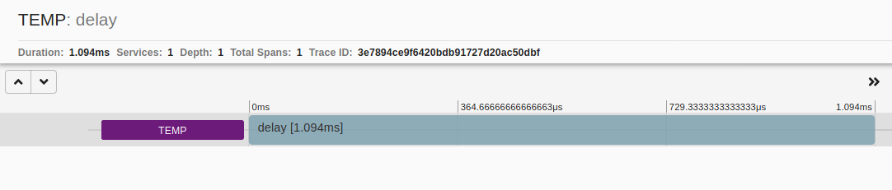
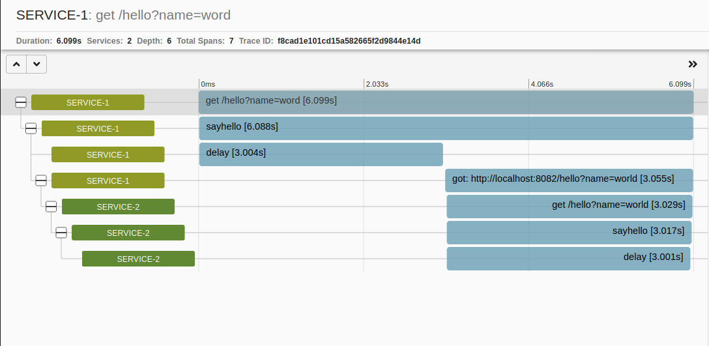

# Tracing Helper

Provides distributed tracing helper

## Usage

### Simple Usage

    const { createSpan, endSpan } = require("tracing-helper");
    const span = createSpan("delay");
    setTimeout(() => {
        console.log('delay for 3 sec');
    }, 3000);
    endSpan(span);

### Service-to-service communication with Got

    const { createSpan, endSpan, instrumentGot } = require("tracing-helper");
    const span = createSpan("delay");
    await delay(3000);
    await instrumentedGot.get("http://localhost:3003/hello?name=Maria");
    endSpan(span);

### Usage With Express as a Middleware

    /*service_1*/

    const httpContext = require("express-http-context");
    const {
    initializeTracer,
    getTracerMiddleware,
    instrumentGot,
    createSpan,
    endSpan
    } = require("tracing-helper");

    const express = require("express");
    const app = express();

    const SERVICE_NAME = "Service-1";
    const ZIPKIN_URL = "http://172.20.1.29:9411/api/v2/spans";
    const instrumentedGot = instrumentGot(got);
    initializeTracer(SERVICE_NAME, ZIPKIN_URL);

    const delay = ms =>
    new Promise(resolve => {
        const span = createSpan("delay");
        setTimeout(() => {
        resolve(ms);
        endSpan(span);
        }, ms);
    });

    const sayHello = async () => {
    const span = createSpan("sayhello");
    await delay(3000);
    await instrumentedGot.get("http://localhost:8082/hello?name=world");
    endSpan(span);
    return `hello world!`;
    };
    app.use(httpContext.middleware);

    app.use(getTracerMiddleware());

    app.get("/hello", async (req, res) => {
    res.json(await sayHello());
    });

    app.listen(8081, () => {
    console.log("Server is listening on port 8081");
    });

---

    /*service_2*/

    const httpContext = require("express-http-context");
    const {
    initializeTracer,
    getTracerMiddleware,
    instrumentGot,
    createSpan,
    endSpan
    } = require("tracing-helper");

    const express = require("express");
    const app = express();

    const SERVICE_NAME = "Service-2";
    const ZIPKIN_URL = "http://172.20.1.29:9411/api/v2/spans";
    initializeTracer(SERVICE_NAME, ZIPKIN_URL);

    const delay = ms =>
    new Promise(resolve => {
        const span = createSpan("delay");
        setTimeout(() => {
        resolve(ms);
        endSpan(span);
        }, ms);
    });

    const sayHello = async () => {
    const span = createSpan("sayhello");
    await delay(3000);
    endSpan(span);
    return `hello world!`;
    };
    app.use(httpContext.middleware);
    app.use(getTracerMiddleware());

    app.get("/hello", async (req, res) => {
    res.json(await sayHello());
    });

    app.listen(8082, () => {
    console.log("Server is listening on port 8082");
    });

## API

`initializeTracer(serviceName: string, zipkinUrl: URL): void`

Initializes the tracer for a service and creates a tracer instance.

`getTracerMiddleware(void): ExpressMiddleware`

Returns an express middleware for tracing incoming HTTP requests.

`createSpan(name: string): Span`

Creates and starts a span. Returns the created span.

`endSpan(span: Span): void`

Ends a previously started span.

`instrumentGot(gotInstance: Got): Got`

Returns an Instrumented Got HTTP Client.
